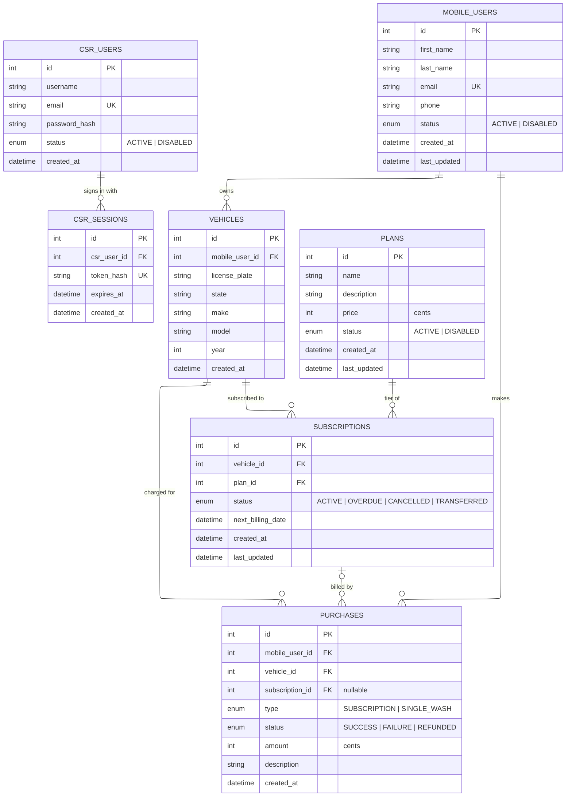
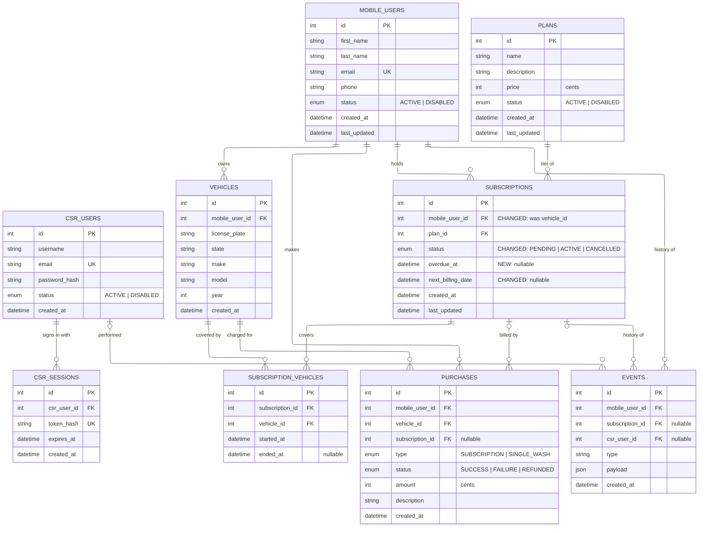

# ER Diagram for CSR-Portal application

## Current model

## Notes

### Key Decisions:
1. Nothing is deleted. Users and plans are retired by setting `status` to `DISABLED`, and subscriptions end as `CANCELLED` or `TRANSFERRED`. A disabled user can't be given a new or transferred subscription.
2. Subscription history is a list of rows per vehicle, ordered by the indexed `(vehicle_id, created_at)`. Where only the latest subscription is needed, take the top result. The proposed revision replaces this with dated coverage rows.
3. Purchases link to the user and vehicle, and to the subscription when it was a subscription charge. They carry a description of what was bought and the amount actually charged.
4. Amounts of money are stored in cents.
5. Plan price lives only on `PLANS` and is not copied onto subscriptions, so a price change applies to every member. Emailing members about a change is intended but not implemented.
6. A transfer only moves a subscription between vehicles of the same customer. It marks the old subscription `TRANSFERRED` and creates a new one on the target vehicle.
7. `CSR_USERS` supports portal login and, eventually, recording who did what. Login is implemented: a CSR signs in with email and password and gets a session (`CSR_SESSIONS`) held in an HttpOnly cookie. Sessions store only a SHA-256 hash of the cookie token and expire 8 hours after sign-in. There is no CSR management UI or roles, so every active CSR can do everything, and accounts are created by the seed script. Recording which CSR made a change is out of scope, so nothing links a change to a CSR yet.

### Rules not enforced by diagram
- Vehicles being one to many is correct for the model, as many subscriptions may associate to a vehicle over time, but each vehicle may only have at most 1 ACTIVE or OVERDUE subscription. This is enforced in the service layer (after vehicles have been pulled). This is enforced via a partial unique index over subscriptions table, which will prevent racing create/transfer requests.

### Out of Scope Improvements
All four are addressed together by the [Proposed Revision](#proposed-revision) below.
1. Subscriptions should instead belong to mobile users, with a separate table on the edge determining which vehicle is assigned to which subscription, to maintain history.
2. Subscriptions and users should have an event history table.
3. Subscriptions status enum currently contains information that could be expressed better by nullable fields that provide additional information, such as a overdue_at field that shows the first failed payment for the subscription reducing the number of terminal statuses and simplifying the data model.
4. Subscriptions need a way to go into a PENDING state before being marked ACTIVE, which will await payment then on successful payment be marked ACTIVE

## Proposed Revision

Today a subscription is bound to a single vehicle, so a transfer has to end one row (`TRANSFERRED`) and create a new one. Billing history is split across the two rows and there is no single record of "this customer's Premium plan". Its status enum also mixes lifecycle (`CANCELLED`, `TRANSFERRED`) with billing health (`OVERDUE`), there is no way to represent a subscription whose first payment is still in flight, and nothing records what happened to an account or who did it.

The revision makes four changes:
1. A subscription becomes a durable **customer ↔ plan agreement**. Which vehicle it covers is a separate, dated fact stored on an edge table. A transfer closes the current coverage row and opens a new one; the subscription, its billing schedule, and its purchase history are untouched.
2. An append-only **events** table records what happened to a customer or subscription, and who did it.
3. `OVERDUE` and `TRANSFERRED` leave the status enum. Overdue becomes a nullable `overdue_at` timestamp and a transfer becomes a coverage change.
4. A subscription starts as **`PENDING`** and only becomes `ACTIVE` once its first payment succeeds.

In the diagram below, `SUBSCRIPTION_VEHICLES` and `EVENTS` are new tables, and `SUBSCRIPTIONS` columns tagged `NEW` or `CHANGED` differ from the current model. All other tables are unchanged.

### What changes
- `SUBSCRIPTIONS.vehicle_id` is removed and replaced by `mobile_user_id`. The subscription now belongs to the customer.
- `SUBSCRIPTION_VEHICLES` is new. Each row says "this subscription covered this vehicle from `started_at` to `ended_at`". An open row (`ended_at IS NULL`) is the current coverage.
- `SubscriptionStatus` becomes `PENDING | ACTIVE | CANCELLED`. `TRANSFERRED` is gone because a transfer is no longer a terminal state of a subscription, it is just a coverage row being closed and another opened. `OVERDUE` is gone because it describes billing health, not lifecycle.
- `SUBSCRIPTIONS.overdue_at` is new. It is set to the time of the first failed payment and cleared when a payment succeeds, so an overdue subscription is an `ACTIVE` one with `overdue_at` set.
- `SUBSCRIPTIONS.next_billing_date` becomes nullable, because a `PENDING` subscription has not been billed yet.
- `EVENTS` is new. Every row is about one customer (`mobile_user_id`), and rows about a subscription also set `subscription_id`, so a customer's whole timeline is one query. `csr_user_id` records which CSR acted, which also gives the previously orphaned `CSR_USERS` table a purpose. Events for CSR users themselves (logins and so on) are not covered here.
- `PURCHASES` is unchanged. `subscription_id` now points at the same subscription across a transfer, and `vehicle_id` records the vehicle that was covered when the charge was made.

### Subscription states
Business states are derived from `status`, `overdue_at`, and the coverage table, rather than stored as separate enum values.

| Business state | `status` | `overdue_at` | Open coverage row | `next_billing_date` |
|---|---|---|---|---|
| Pending first payment | `PENDING` | NULL | Yes, reserves the vehicle | NULL |
| Active | `ACTIVE` | NULL | Yes | Set |
| Overdue | `ACTIVE` | Set | Yes | Set |
| Cancelled | `CANCELLED` | Left as it was | No | Left as it was |

Transitions:
- **Create.** Insert the subscription as `PENDING` with an open coverage row, then attempt the first payment. The row exists while the payment is in flight, so the vehicle can't be claimed by a second request, and no `ACTIVE` row is created before the customer has paid.
- **First payment succeeds.** `PENDING → ACTIVE`, set `next_billing_date`.
- **First payment fails.** `PENDING → CANCELLED` and close the coverage row, which frees the vehicle. The failed purchase row stays as the record.
- **Renewal fails.** Set `overdue_at = now()` only if it is NULL, so it keeps the first failure. The status stays `ACTIVE`.
- **Renewal succeeds.** Clear `overdue_at`. Earlier overdue episodes are still visible as events.
- **Cancel.** `PENDING | ACTIVE → CANCELLED` and close the coverage row.

### Transfer, before and after
| | Current model | Proposed model |
|---|---|---|
| Rows written | Old subscription set to `TRANSFERRED`, new subscription inserted | Open coverage row gets `ended_at = now()`, new coverage row inserted, one event row |
| Billing schedule | Reset on the new row (or copied) | Unchanged, `next_billing_date` stays on the same subscription |
| Purchase history | Split across two subscription ids | All under one subscription id |
| Audit trail | None | `SUBSCRIPTION_TRANSFERRED` event with the old and new vehicle ids in `payload` and the acting CSR |
| Answering "what has this customer paid for Premium?" | Walk a chain of transferred rows | Sum purchases for one subscription |
| Answering "which vehicle was covered on date X?" | `created_at` ordering across rows | `started_at <= X AND (ended_at IS NULL OR ended_at > X)` |

All writes happen in one transaction.

### Rules not enforced by diagram (proposed)
- A vehicle is covered by at most one subscription at a time: partial unique index on `subscription_vehicles (vehicle_id) WHERE ended_at IS NULL`. A `PENDING` subscription holds its vehicle the same way an `ACTIVE` one does.
- A subscription covers at most one vehicle at a time: partial unique index on `subscription_vehicles (subscription_id) WHERE ended_at IS NULL`. This keeps today's one-vehicle-per-subscription behaviour. Dropping this index is all it takes to allow multi-vehicle plans later.
- The two indexes above replace the current `subscriptions_vehicle_id_live_key` index. Both still prevent racing create/transfer requests.
- A subscription may only cover a vehicle owned by its `mobile_user_id`. This is a service-layer check because it spans three tables.
- A `CANCELLED` subscription has no open coverage row, so cancelling also sets `ended_at` on the open row. This frees the vehicle to be subscribed again.
- Coverage rows for the same subscription must not overlap in time. The partial unique index covers the open row, and the service layer sets `ended_at` on the old row before inserting the new one.
- Allowed status transitions are `PENDING → ACTIVE`, `PENDING → CANCELLED`, and `ACTIVE → CANCELLED`. `CANCELLED` is terminal. This is enforced in the service layer.
- `overdue_at` is only set on `ACTIVE` subscriptions, which can be a check constraint.
- `EVENTS` is append-only: rows are never updated or deleted, and each is written in the same transaction as the change it describes.

### Migration sketch
1. Create `subscription_vehicles` and its partial unique indexes, and create `events`.
2. Backfill one coverage row per existing subscription: `started_at = created_at`, `ended_at = NULL` for `ACTIVE | OVERDUE`, `ended_at = last_updated` for `CANCELLED | TRANSFERRED`.
3. Add `subscriptions.mobile_user_id`, backfilled from `vehicles.mobile_user_id` via the old `vehicle_id`. Add `overdue_at` and make `next_billing_date` nullable.
4. Optionally merge existing `TRANSFERRED` chains into a single subscription. Without this step, old history stays split but nothing new will be.
5. Convert statuses. `OVERDUE` becomes `ACTIVE` with `overdue_at` set to the earliest failed purchase after the last successful one, falling back to `last_updated`. Leftover `TRANSFERRED` rows become `CANCELLED`.
6. Optionally seed `events` from existing timestamps (one `SUBSCRIPTION_CREATED` per subscription, plus `SUBSCRIPTION_CANCELLED` or `SUBSCRIPTION_TRANSFERRED` where applicable). Anything more detailed than that can't be recovered, and these rows have no acting CSR.
7. Drop `subscriptions.vehicle_id`, the old partial index, and the `OVERDUE` and `TRANSFERRED` enum values. Add `PENDING`.
