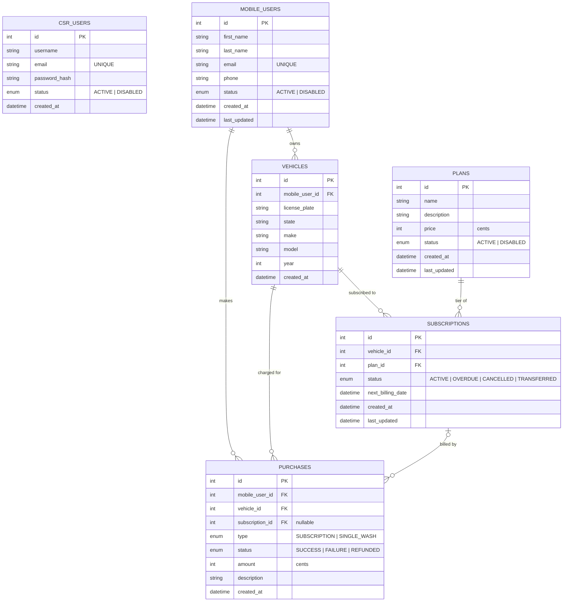

## Notes

### Rules not enforced by diagram:
- Vehicles being one to many is correct for the model, as many subscriptions may associate to a vehicle over time, but each vehicle may only have at most 1 ACTIVE or OVERDUE subscription. This is enforced in the service layer (after vehicles have been pulled). This is enforced via a partial unique index over subscriptions table, which will prevent racing create/transfer requests.
- CSR_USERS was added to support authentication and event logging. Table is orphaned right now, because event logging and authentication are out of scope.

### Out of Scope Improvements:
1. Subscriptions should insetead belong to mobile users, with a separate table on the edge determining which vehicle is assigned to which subscription, to maintain history.
2. Subscriptions should have an event history table.
3. Subscriptions status enum currently contains information that could be expressed better by nullable fields that provide additional information, such as a overdue_at field that shows the first failed payment for the subscription reducing the number of terminal statuses and simplifying the data model.
4. Subscriptions need a way to go into a PENDING state before being marked ACTIVE, which will await payment then on successful payment be marked ACTIVE

