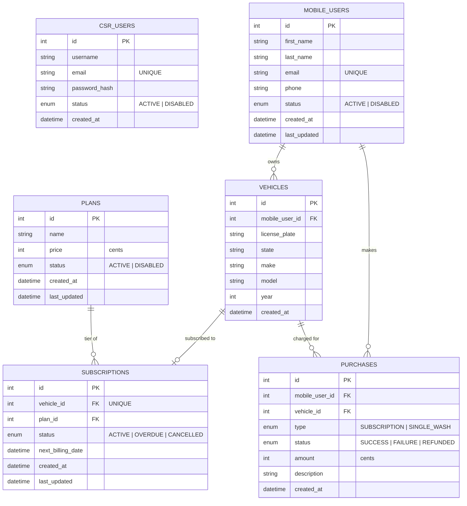

```mermaid
erDiagram
	CSR_USERS{
        int id PK
        string username
        string email "UNIQUE"
        string password_hash
        enum status "ACTIVE | DISABLED"
        datetime created_at
	}
	MOBILE_USERS{
		int id PK
		string first_name
		string last_name
		string email "UNIQUE"
		string phone
		enum status "ACTIVE | DISABLED"
		datetime created_at
        datetime last_updated
	}
	VEHICLES{
		int id PK
		int mobile_user_id FK
        string license_plate
        string state
        string make
        string model
        int year
        datetime created_at
	}
    PLANS{
        int id PK
        string name
        int price "cents"
        enum status "ACTIVE | DISABLED"
        datetime created_at
        datetime last_updated
    }
	PURCHASES{
		int id PK
        int mobile_user_id FK
        int vehicle_id FK
		enum type "SUBSCRIPTION | SINGLE_WASH"
        enum status "SUCCESS | FAILURE | REFUNDED"
		int amount "cents"
        string description
        datetime created_at
	}
	SUBSCRIPTIONS{
		int id PK
		int vehicle_id FK "UNIQUE"
        int plan_id FK
        enum status "ACTIVE | OVERDUE | CANCELLED"
        datetime next_billing_date
        datetime created_at
        datetime last_updated
	}
	
	MOBILE_USERS ||--o{ VEHICLES : "owns"
	MOBILE_USERS ||--o{ PURCHASES : "makes"
	VEHICLES ||--o| SUBSCRIPTIONS : "subscribed to"
    PLANS ||--o{ SUBSCRIPTIONS : "tier of"
    VEHICLES ||--o{ PURCHASES : "charged for"
```